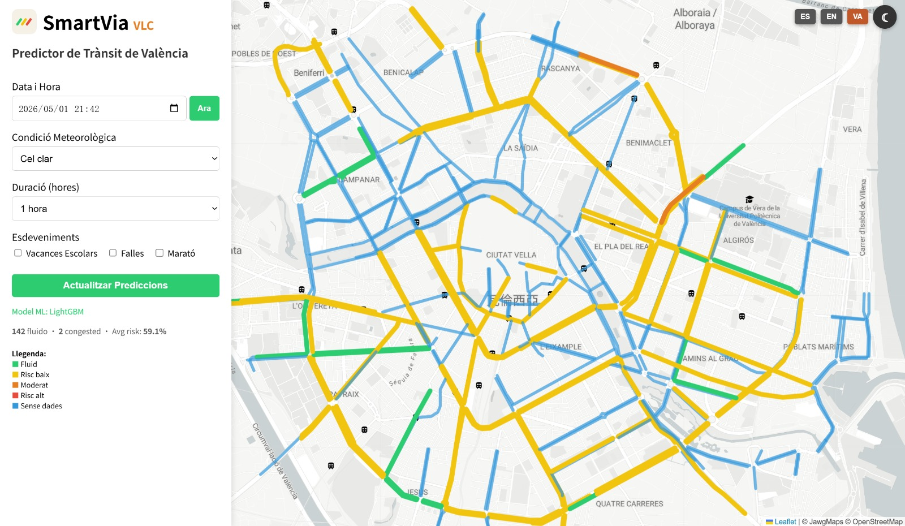

<p align="center">
  
</p>

<p align="center">
  <strong>Real-time traffic congestion predictor for Valencia, Spain</strong><br>
  Powered by LightGBM &middot; Flask &middot; Leaflet.js
</p>

<p align="center">
  
  
  
  
  
</p>

---

## Overview

SmartVia VLC is a machine learning-based web application that predicts traffic congestion across **144 road segments** in Valencia, Spain. Users can select a date, time, weather condition, and special events to visualize predicted traffic states on an interactive map. We have developed a website, www.smartviavlc.com, and it is deployed via AWS.

This project was developed as part of **Proyecto III** in the **Grado en Ciencia de Datos** at the **Universitat Politecnica de Valencia (UPV)**.



## Features

- **ML-Powered Predictions** -- LightGBM model trained on historical traffic data with lag features and SMOTE balancing
- **Interactive Map** -- Leaflet.js map with color-coded road segments indicating congestion risk
- **Weather Integration** -- Predictions adjust for clear, cloudy, and rainy conditions
- **Event Awareness** -- Accounts for Fallas, school holidays, and marathons
- **Multi-language** -- English, Spanish, Valencian, and Chinese
- **Day/Night Mode** -- Toggle between light and dark map themes
- **Responsive Design** -- Works on desktop and mobile devices

## Architecture

```
User (Browser)
     |
     v
  Nginx (port 80) --> Gunicorn --> Flask API (app3.py)
                                      |
                              LightGBM Model (.txt)
                              Preprocessors (.joblib)
                              Historical Seeds (.joblib)
```

## Tech Stack

| Component       | Technology                          |
|-----------------|-------------------------------------|
| ML Model        | LightGBM (gradient boosting)        |
| Data Balancing  | SMOTE + undersampling               |
| Backend         | Flask + Gunicorn                    |
| Frontend        | HTML/CSS/JS + Leaflet.js            |
| Map Tiles       | Jawg Maps (Light & Dark)            |
| Deployment      | AWS EC2 + Nginx + Route 53          |

## Project Structure

```
.
├── app3.py                      # Flask API server
├── website3.html                # Frontend (map + controls)
├── datos_trafico.js             # Road segment polyline coordinates
├── smartvia-logo-light.svg      # App logo (SVG)
├── smartvia.png                 # App logo (PNG)
├── train_lightgbm_lag_v2.py     # Model training script
├── save_preprocessors_lag.py    # Generates .joblib preprocessors
├── lightgbm_lag_v2_model.txt    # Trained LightGBM model
├── historical.joblib            # Historical traffic probabilities
├── historical_fallback.joblib   # Fallback probabilities
├── le_denom.joblib              # Road name label encoder
├── le_day.joblib                # Day of week label encoder
├── scaler_lag.joblib            # Feature scaler
├── known_roads.joblib           # List of 144 known roads
├── DatasetFestivos.csv          # Holidays and events dataset
├── climatologia_2023_2025.csv   # Weather data (AEMET)
└── dataset_final.zip            # Full training dataset (compressed)
```

## Installation

### Local Setup

```bash
git clone https://github.com/jiale203/SmartVia-VLC---Valencia-Traffic-Predictor.git
cd smartvia-vlc

pip install flask flask-cors pandas numpy lightgbm joblib scikit-learn gunicorn

python app3.py
```

Visit `http://localhost:5002` in your browser.

## AWS Deployment

  The application is deployed on **AWS EC2** with the following architecture:

  Client (Browser)
        │
        ▼
    Route 53 (DNS)
        │
        ▼
    EC2 Instance (Ubuntu 22.04)
        │
        ▼
    Nginx (port 80/443) ──► Gunicorn ──► Flask API (app3.py)
                                              │
                                      LightGBM Model
                                      Preprocessors (.joblib)

  - Gunicorn serves the Flask API as a production WSGI server
  - Nginx acts as a reverse proxy, forwarding HTTP/HTTPS requests to the application
  - A systemd service keeps the application running and auto-restarts on server reboot
  - Domain managed through AWS Route 53 with A records pointing to the EC2 public IP
  - SSL/TLS encryption enabled via Let's Encrypt (Certbot) for secure HTTPS access

## Model Details

| Parameter          | Value                                     |
|--------------------|-------------------------------------------|
| Algorithm          | LightGBM (gradient boosted trees)         |
| Training Data      | ~400K samples (SMOTE balanced)            |
| Features           | 39 (temporal, weather, lag, events)        |
| Lag Features       | estado_lag_1, lag_2, lag_4, rolling_4/8    |
| Congestion Threshold | 0.8 probability                         |
| Macro F1 Score     | 0.8762                                    |
| Prediction Interval | 15 minutes                               |

### Key Features Used

| Feature              | Importance   |
|----------------------|-------------|
| estado_rolling_8     | Very High   |
| estado_lag_1         | Very High   |
| hour_sin / hour_cos  | High        |
| minutes              | High        |
| Road (encoded)       | Medium      |
| Weather (tmed, sol)  | Medium      |
| Events (Fallas, etc.)| Low-Medium  |

## Data Sources

- **Traffic Data** -- Ajuntament de Valencia open data portal (real-time traffic sensors)
- **Weather Data** -- AEMET (Agencia Estatal de Meteorologia)
- **Holiday/Event Data** -- Manually curated calendar of local events


## Data preprocessing


  Notebooks → Agregacion2.csv (traffic) + climatologia_2023_2025.csv (weather)
                                        ↓
                             merge_traffic_weather.py → datos_combinados_limpios.csv (traffic + weather merged)
                                                                        ↓
                                                                        c.py → dataset_final.csv (+ holidays) → dataset_final.zip
          

## Feature variables

  **Road Identifier (1)**

  | Feature | Description |
  |---------|-------------|
  | `Denominació_/_Denominación` | Encoded name of the road segment (144 unique roads across Valencia) |

  **Weather (5)**

  | Feature | Description |
  |---------|-------------|
  | `tmed` | Mean daily temperature (°C) |
  | `tmin` | Minimum daily temperature (°C) |
  | `tmax` | Maximum daily temperature (°C) |
  | `prec` | Daily precipitation (mm) |
  | `sol` | Hours of sunshine |

  **Temporal (14)**

  | Feature | Description |
  |---------|-------------|
  | `minutes` | Minutes elapsed since midnight (0–1440) |
  | `hour_sin`, `hour_cos` | Cyclical encoding of the hour to capture periodic patterns |
  | `month`, `month_sin`, `month_cos` | Month of the year with cyclical encoding |
  | `day`, `day_sin`, `day_cos` | Day of the month with cyclical encoding |
  | `Day_of_week` | Encoded day of the week (lunes–domingo) |
  | `week_of_year` | Week number within the year |
  | `is_weekend` | Binary flag for Saturday/Sunday |
  | `is_rush_hour` | Binary flag for peak traffic hours (7–9h and 17–20h) |
  | `is_night` | Binary flag for nighttime hours (22–6h) |

  **Seasons (4)**

  | Feature | Description |
  |---------|-------------|
  | `Summer`, `Winter`, `Autumn`, `Spring` | Binary flags indicating the current season |

  **Events (13)**

  | Feature | Description |
  |---------|-------------|
  | `Public_holiday`, `School_holiday` | Binary flags for public and school holidays |
  | `Fallas`, `Mascletá/Crida` | Binary flags for Valencia's Fallas festival and its daily firecracker event |
  | `Football_Matches` | Binary flag for local football match days |
  | `Marathons` | Binary flag for marathon events |
  | `Festival_de_les_arts`, `Davis_Cup`, `Elections`, `Demonstrations`, `University_Entrance_Exams`, `BigSound_Concerts`,
  `Roig_Arena_Events`, `San_Juan` | Binary flags for other local events |

  **Lag Features — Historical Traffic State (6)**

  | Feature | Description |
  |---------|-------------|
  | `estado_lag_1` | Traffic state 15 minutes prior |
  | `estado_lag_2` | Traffic state 30 minutes prior |
  | `estado_lag_4` | Traffic state 1 hour prior |
  | `estado_rolling_4` | Rolling average of traffic state over the last 4 intervals (1 hour) |
  | `estado_rolling_8` | Rolling average of traffic state over the last 8 intervals (2 hours) |
  | `estado_count_4` | Count of congested intervals in the last 4 intervals (1 hour) |


## Model Explaination

  - The LightGBM model is trained on ~400,000 samples from traffic sensor data collected between 2023–2024, with 2025
  reserved as the test set
  - The dataset is heavily imbalanced (99% fluido vs 1% no_fluido), so a combination of random undersampling and SMOTE
  balances the training data to a 50/50 distribution
  - The model is trained for 500 boosting rounds using binary log-loss as the objective, with L1/L2 regularization to
  prevent overfitting
  - Lag features (estado_lag_1, estado_rolling_8, estado_count_4, etc.) are engineered by shifting and aggregating past
  traffic states within each road segment to capture short-term temporal dependencies
  - Continuous variables (temperature, precipitation, sunshine, cyclical time encodings) are standardized using
  StandardScaler; categorical variables (road names, days of the week) are encoded using LabelEncoder
  - After training, save_preprocessors_lag.py generates all preprocessing artifacts needed for deployment:
    - Fitted LabelEncoder for road names and days of the week
    - Fitted StandardScaler for continuous features
    - List of 144 known roads
    - Two historical probability tables containing average congestion rates per road, day of week, and time slot — used
  to seed lag features during prediction
  - All artifacts are serialized using joblib and saved as .joblib files, which Flask loads at startup to transform raw
  user inputs into the exact feature format the model expects, ensuring consistency between training and prediction

### Evaluation Results (Test Set — 2025)

  | Metric | Fluido (0) | No Fluido (1) |
  |--------|-----------|---------------|
  | Precision | 1.00 | 0.69 |
  | Recall | 0.99 | 0.84 |
  | F1-Score | 0.99 | 0.76 |

  | Overall Metric | Value |
  |----------------|-------|
  | Accuracy | 0.99 |
  | Macro F1 Score | 0.8762 |
  | Congestion Threshold | 0.5 |

  ## Limitations

  - **Probability Calibration**: The model is trained on SMOTE-balanced data (50/50), but the real distribution is
  approximately 99% fluido / 1% no_fluido. This means the model's output probabilities are calibrated to the artificial
  distribution rather than reality, requiring a higher decision threshold (0.8) to compensate
  - **No Real-Time Data**: The application does not have access to live traffic sensors. Instead, lag features are
  approximated using historical average congestion probabilities per road, day of week, and time slot. Predictions would
   be more accurate with real-time traffic feeds
  - **Night Data Gap**: Traffic data between 1:00–6:00 was removed during preprocessing due to sensor inactivity. This
  creates a mismatch in lag features at 7:00 AM — during training, the model references late-night data, while during
  deployment, the historical lookup attempts to retrieve values from the deleted time range
  - **Static Weather Presets**: Weather conditions are selected from fixed presets (clear, cloudy, rainy) rather than
  fetched from a live weather API, which limits prediction accuracy for unusual weather conditions
  - **Event Detection**: Special events (Fallas, marathons, etc.) must be manually selected by the user rather than
  being automatically detected from an external calendar

  ## Future Work

  - Integrate a **live traffic API** from the Ajuntament de Valencia to replace historical seeds with real-time lag
  features
  - Connect a **real-time weather API** (AEMET OpenData) to automatically set weather parameters based on current or
  forecasted conditions
  - Add **route recommendation** functionality to suggest the least congested path between two points

## License

This project is licensed under the [GNU License](LICENSE).

## Authors
- Jiale Mao
- Vicente Llacer Llorca
- Miguel Angel Carrañas
- Ivette Mahmoud Yousef
- Lucia Fuentes Pons
- Maria Martinez
